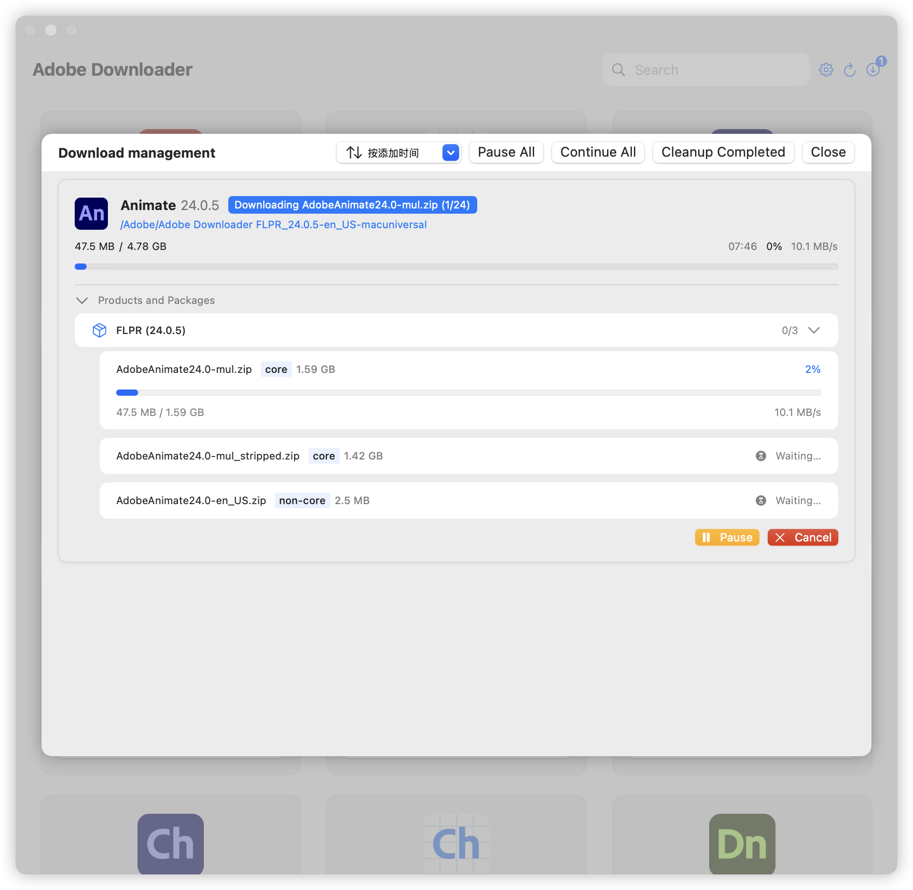

# Adobe Downloader


# **[中文版本](readme.md)**

## Before Use

**🍎Only for macOS 12.0+.**

> **If you like Adobe Downloader, or it helps you, please Star🌟 it.**
>
> 1. Before installing Adobe products, the Adobe Setup component must be present on your system; otherwise, the
     installation feature will not work. You can download it through the built-in “Settings” in the program or
     from [Adobe Creative Cloud](https://creativecloud.adobe.com/apps/download/creative-cloud).
> 2. To enable smooth installation after downloading, Adobe Downloader needs to modify Adobe’s Setup program. This
     process is fully automated by the program and requires no user intervention. Many thanks
     to [QiuChenly](https://github.com/QiuChenly) for providing the solution.
> 3. If you encounter any problems, don't panic, contact [@X1a0He](https://t.me/X1a0He) on Telegram or use the Python
     version. Many thanks to [Drovosek01](https://github.com/Drovosek01) for
     the [adobe-packager](https://github.com/Drovosek01/adobe-packager)
> 4. ⚠️⚠️⚠️ **All Adobe apps in Adobe Downloader are from official Adobe channels and are not cracked versions.**
> 5. ❌❌❌ **Do not use an external hard drive or any USB to store it, as this will cause permission issues, I do not have
     the patience to solve any about permission issues**

## FAQ

**This section will be updated periodically with meaningful issues that have been raised.**

### **[NEW] About error codes and Helper**

Before version 1.3.0, many operations required users to enter passwords because root permissions or higher permissions
were not obtained

Therefore, we introduced the Helper mechanism in version 1.3.0. You only need to install the Helper and then the
subsequent Setup component processing. Product installation no longer requires entering a password

You may see relevant prompts in the upper right corner. Please rest assured that your system is very safe. This is
because of macOS's Helper mechanism and signed pop-up windows

If you are still worried about problems, please find a professional to check the relevant code, although it is futile

### **Explanation of relevant error codes**

- 2700: It is unlikely to occur unless the Setup component processing fails

- 107: The downloaded file architecture is inconsistent with the system architecture or the installation file is
  damaged. It is unlikely to occur in version 1.3.0

- 103: There is a permission problem. It is unlikely to occur in version 1.3.0

- 182: The file is incomplete or damaged, version 1.3.0 is unlikely to appear
- 133: Insufficient system disk space
- -1: The Setup component was not processed or failed to process, please contact the developer
- 195: The downloaded product does not support your current system

### Questions about the Setup Component

> It’s mentioned in the usage instructions that to use the installation feature, you need to modify Adobe’s setup
> component. You can find details in the code.

Why is this necessary? Without modifications, installation will fail with error code 2700.

> **Does the setup modification require user intervention?**

No, Adobe Downloader automates the setup component handling, including backup. All you need to do is enter your password
when prompted.

## 📔Latest Log

- For historical update logs, please go to [Update Log](update-log.md)

- 2024-11-19 00:55 Update Log

```markdown
1. Simulate the package dependency download logic of the official Adobe Creative Cloud
2. Due to the above updates, the problem of insufficient download quantity of some packages has been fixed
3. Fixed when HDBox and IPCBox already exist, the problem that the original components will not be replaced after
   downloading X1a0He CC components
4. Fixed the problem that Acrobat products are still in downloading status when paused and canceled
5. Add product quantity display at the bottom and display warning slogan in the center
6. Add some language selections
7. Optimize the sorting display of the version selection page
8. Optimize product processing and parsing speed, abandon xml processing and parsing, and use json processing

PS: Most products have been tested on M1 Max and downloaded and installed normally, but Intel has not been tested. If
you have any questions, please raise issues
```

### Language friendly

- [x] Chinese
- [x] English

## ⚠️ Warning

**For all the SwiftUI seniors, I am just a SwiftUI newbie, some of the code comes from Claude, OpenAI and Apple, etc.**
\
**If you have any optimization suggestions or questions about Adobe Downloader, please open an issue or contact @X1a0He
via Telegram.**

## ✨ Features

- [x] Basic Functionality
    - [x] Download Acrobat Pro
    - [x] Download other Adobe products
    - [x] Support installation of non-Acrobat products
    - [x] Support multiple products download at the same time
    - [x] Supports using default language and default directory
    - [x] Support task record persistence

## 👀 Preview

### Light Mode & Dark Mode


### Version Picker


### Language Picker


### Download Management



## 🔗 References

- [Drovosek01/adobe-packager](https://github.com/Drovosek01/adobe-packager/)
- [QiuChenly/InjectLib](https://github.com/QiuChenly/InjectLib/)

## 👨🏻‍💻Author

Adobe Downloader © X1a0He

Released under GPLv3. Created on 2024.11.05.

> GitHub [@X1a0He](https://github.com/X1a0He/) \
> Telegram [@X1a0He](https://t.me/X1a0He)
