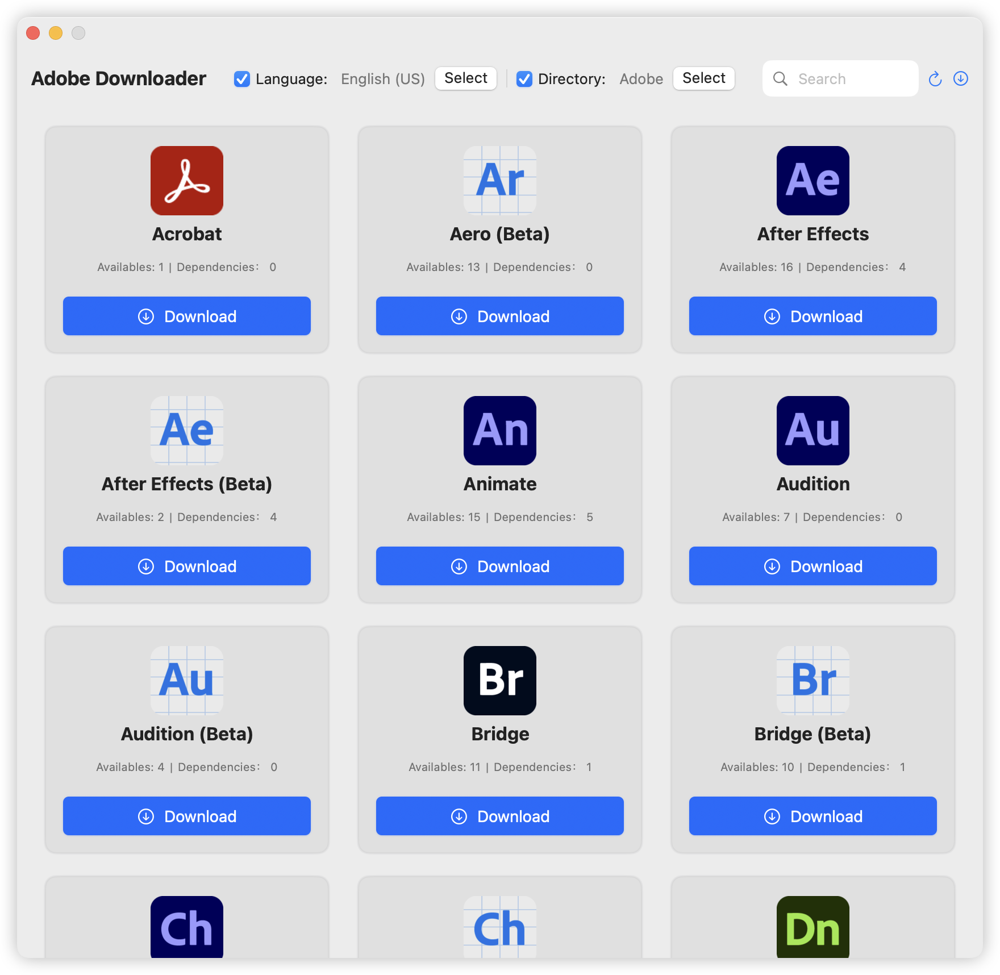
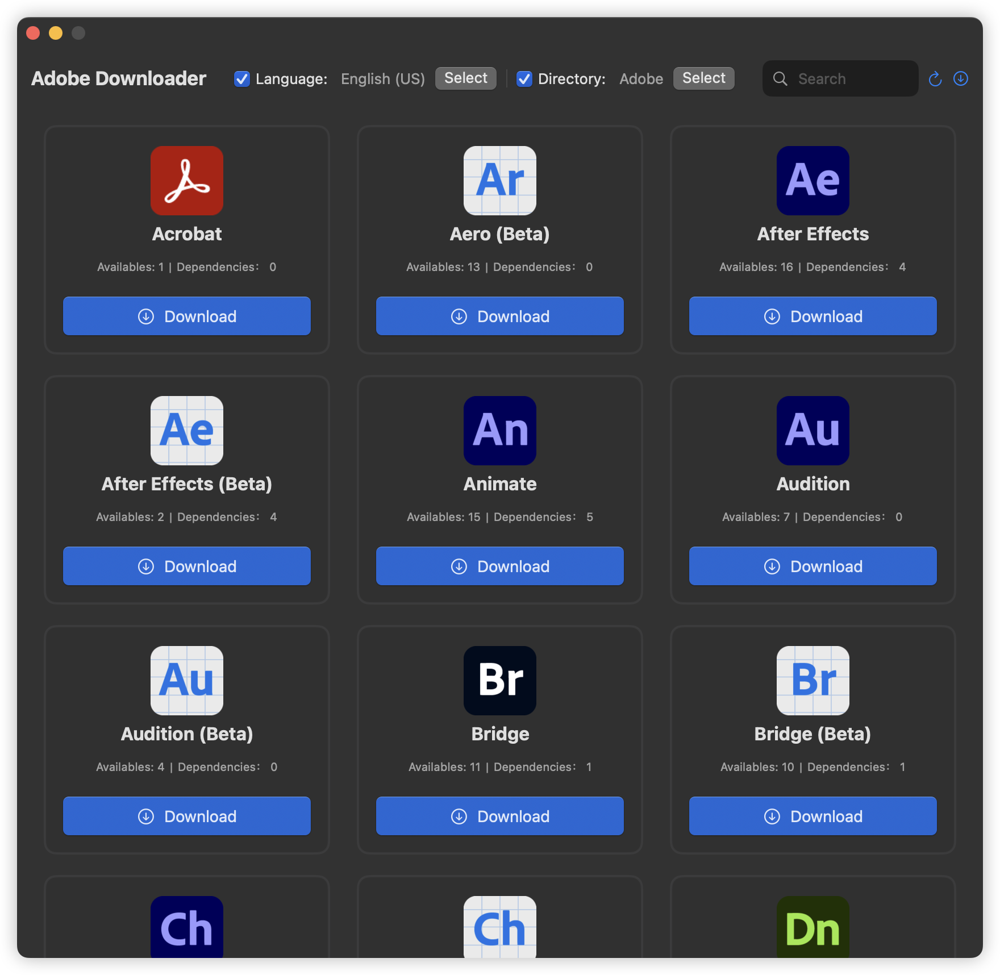
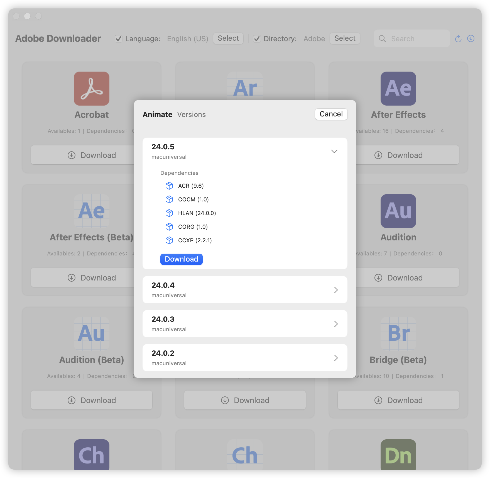
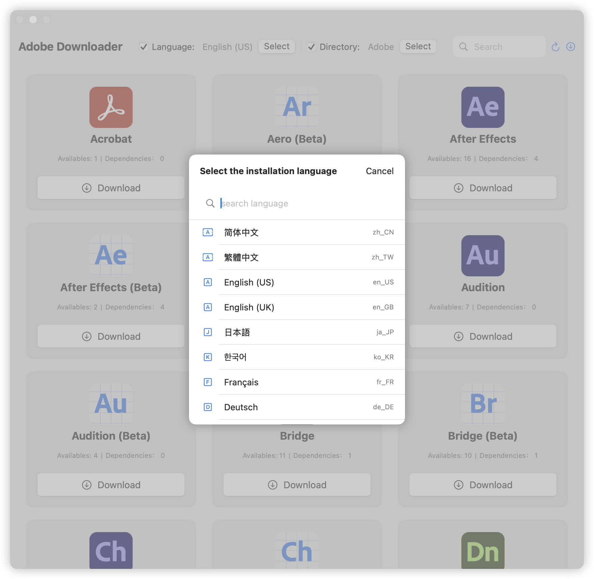
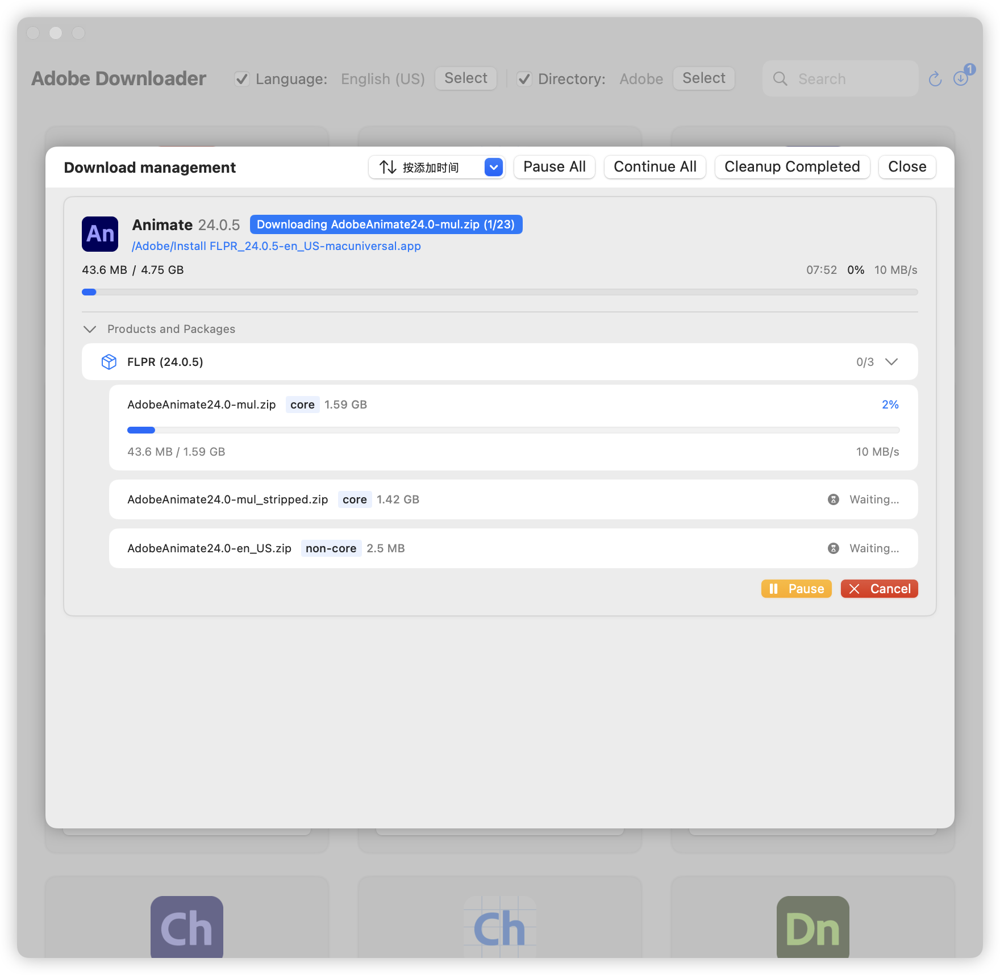

# Adobe Downloader


# **[English version](readme-en.md)**

## 使用须知

**🍎仅支持 macOS 12.0+**

> **如果你也喜欢 Adobe Downloader, 或者对你有帮助, 请 Star 仓库吧 🌟, 你的支持是我更新的动力**
>
> 1. 在对Adobe产品进行安装前，系统必须存在 Adobe Setup 组件，否则无法使用安装功能，可通过程序内置的"设置"
     中进行下载，或前往[Adobe Creative Cloud](https://creativecloud.adobe.com/apps/download/creative-cloud)进行下载
> 2. 为了能够在下载后顺利安装，Adobe Downloader 需要对 Adobe 的 Setup
     程序做出修改，该过程由程序全自动，无需用户介入，非常感谢 [QiuChenly](https://github.com/QiuChenly)
     提供的解决方案
> 3. 如果在使用过程中遇到问题， 请通过 Telegram 联系我: [@X1a0He](https://t.me/X1a0He) , 或者使用 Python
     版本，非常感谢 [Drovosek01](https://github.com/Drovosek01)
     的 [adobe-packager](https://github.com/Drovosek01/adobe-packager)
> 4. ⚠️⚠️⚠️ **Adobe Downloader 中的所有 Adobe 应用均来自 Adobe 官方渠道，并非破解版本。**
> 5. ❌❌❌ **不要将下载目录设置为外接移动硬盘或者USB设备，这会导致出现权限问题，我并没有时间也没有耐心处理任何权限问题**
> 6. ❌❌❌ **由于权限原因，可能会在黑苹果上出现无法安装的问题**

## 常见问题

**这里会不定时更新一些 issues 出现过的，并且有意义的问题**

### 关于 setup 组件的问题

> 使用须知中强调了，如果需要使用安装功能，那么就必须对 Adobe 的 setup 组件进行修改处理，你可以在代码中找到

为什么要处理，因为不处理无法安装，会出现2700错误代码

> **setup处理是否需要用户手动处理？**

并不需要，Adobe Downloader已完成了全自动处理且备份 setup 组件的功能，你需要做的只有输入密码即可

### 关于程序中需要输入密码的问题

> 为什么安装 setup 组件的时候，需要输入密码？

在从 GitHub 中下载 setup 组件到系统中的时候，需要文件写入，所以需要 sudo 权限

> 在 GitHub 下载？我的密码会被传输到网络上吗？

并不会，你输入的每一次密码，均由 Adobe Downloader 调用系统程序弹出，你可以完全放心输入你的密码，除了你自己，没有人会知道你的密码，Adobe
Downloader也不例外

> 为什么要输入那么多次密码？什么情况下要输入密码

1. 在进行 setup 组件下载安装的时候
2. 在进行 setup 组件进行备份且修改的时候
3. 在调用 setup 组件进行 Adobe apps 进行安装的时候
4. 一切需要权限才能完成的操作(还是那句话，你可以完全放心输入你的密码)

## 📔 最新日志

- 更多关于 App 的更新日志，请查看 [Update Log](update-log.md)

- 2024-11-11 21:00 更新日志

```markdown
1. 调整程序启动时 sheet 的弹出顺序
2. 设置中添加了 Setup 组件的检测和版本号检测，支持在设置中重新备份与处理
3. 调整 Setup 组件的检测，不再需要完整安装 Adobe Creative Cloud
4. 增加了安装前 Setup 组件是否已处理的判断，未处理 Setup 组件，无法使用安装功能
5. 调整 Setup 组件检测弹窗界面
6. 增加从 GitHub 中下载 Setup 组件，无法访问 GitHub 的用户可能会出现无法下载的问题

PS: Setup 组件的来源均为 Adobe Creative Cloud 官方提取，可能存在更新不及时
```

### 语言支持

- [x] 中文
- [x] English

## ⚠️ 注意

**对于各位 SwiftUI 前辈来说，我只是一个 SwiftUI 新手，部分代码来自 Claude、OpenAI 和 Apple 等**
\
**如果你对 Adobe Downloader 有任何优化建议或疑问，请提出 issue 或通过 Telegram 联系 [@X1a0He](https://t.me/X1a0He)**

## ✨ 特点

- [x] 基本功能
    - [x] Acrobat Pro 的下载
    - [x] 其他 Adobe 产品的下载
    - [x] 支持安装非 Acrobat 产品
    - [x] 支持多个产品同时下载
    - [x] 支持使用默认语言和默认目录
    - [x] 支持任务记录持久化

## 👀 预览

### 浅色模式 & 深色模式




### 版本选择



### 语言选择



### 下载任务管理



## 🔗 引用

- [Drovosek01/adobe-packager](https://github.com/Drovosek01/adobe-packager/)
- [QiuChenly/InjectLib](https://github.com/QiuChenly/InjectLib/)

## 👨🏻‍💻作者

Adobe Downloader © X1a0He

Released under GPLv3. Created on 2024.11.05.

> GitHub [@X1a0He](https://github.com/X1a0He/) \
> Telegram [@X1a0He](https://t.me/X1a0He)
