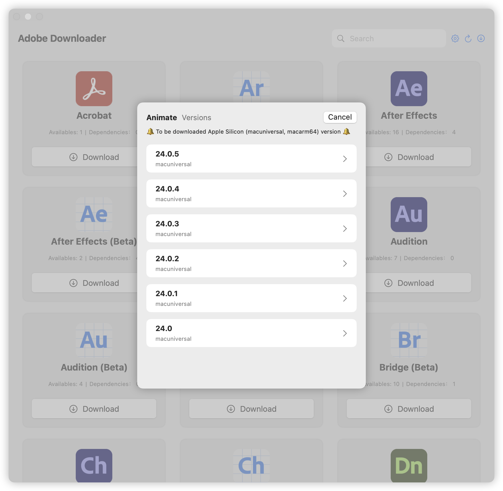

# Adobe Downloader


# **[English version](readme-en.md)**

## 使用须知

**🍎仅支持 macOS 14+.**

> **如果你也喜欢 Adobe Downloader, 或者对你又帮助, 请 Star 仓库吧 🌟, 你的支持是我更新的动力**
>
> 1. 在对
     Adobe产品进行安装前，你必须先安装 [Adobe Creative Cloud](https://creativecloud.adobe.com/apps/download/creative-cloud)
     ，否则将无法使用本程序
> 2. 为了能够在下载后顺利安装，你需要对 Adobe 的 Setup 程序做出修改，非常感谢 [QiuChenly](https://github.com/QiuChenly)
     提供的解决方案
> 3. 如果在使用过程中遇到问题， 请通过 Telegram 联系我: [@X1a0He](https://t.me/X1a0He) , 或者使用 Python
     版本，非常感谢 [Drovosek01](https://github.com/Drovosek01)
     的 [adobe-packager](https://github.com/Drovosek01/adobe-packager)
> 4. ⚠️⚠️⚠️ **Adobe Downloader 中的所有 Adobe 应用均来自 Adobe 官方渠道，并非破解版本。**
> 5. ❌❌❌ **不要将下载目录设置为外接移动硬盘或者USB设备，这会导致出现权限问题，我并没有时间也没有耐心处理任何权限问题**

## 📔 最新日志

- 更多关于 App 的更新日志，请查看 [Update Log](update-log.md)

- 2024-11-06 15:50 更新日志

```markdown
1. 增加程序首次启动时的默认配置设定与提示
2. 增加可选架构下载，请在设置中进行选择
3. 修复了版本已存在检测错误的问题 \(仅检测文件是否存在，并不会检测是否完整\)
4. 移除主界面的语言选择和目录选择，移动到了设置中
5. 版本选择页面增加架构提示
6. 移除了安装程序的机制，现在不会再生成安装程序
7. 增加了Adobe Creative Cloud安装检测，未安装前无法使用
```

### 语言支持

- [x] 中文
- [x] English

## ⚠️ 注意

**对于各位 SwiftUI 前辈来说，我只是一个 SwiftUI 新手，部分代码来自 Claude、OpenAI 和 Apple 等**
\
**如果你对 Adobe Downloader 有任何优化建议或疑问，请提出 issue 或通过 Telegram 联系 [@X1a0He](https://t.me/X1a0He)**

## ✨ 特点

- [x] 基本功能
    - [x] Acrobat Pro 的下载
    - [x] 其他 Adobe 产品的下载
    - [x] 支持安装非 Acrobat 产品
    - [x] 支持多个产品同时下载
    - [x] 支持使用默认语言和默认目录

## 👀 预览

### 浅色模式 & 深色模式


### 版本选择



### 语言选择


### 下载任务管理


## 🔗 引用

- [Drovosek01/adobe-packager](https://github.com/Drovosek01/adobe-packager/)
- [QiuChenly/InjectLib](https://github.com/QiuChenly/InjectLib/)

## 👨🏻‍💻作者

Adobe Downloader © X1a0He

Released under GPLv3. Created on 2024.11.05.

> GitHub [@X1a0He](https://github.com/X1a0He/) \
> Telegram [@X1a0He](https://t.me/X1a0He)
