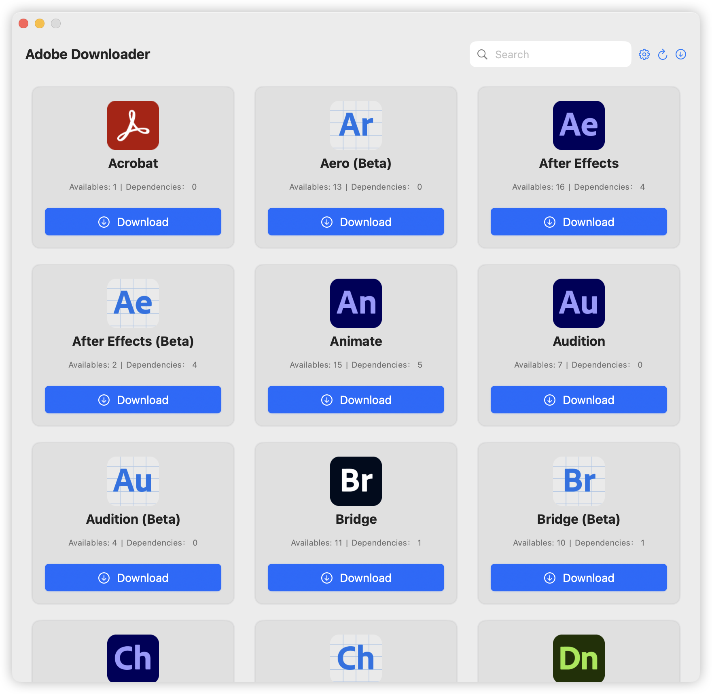
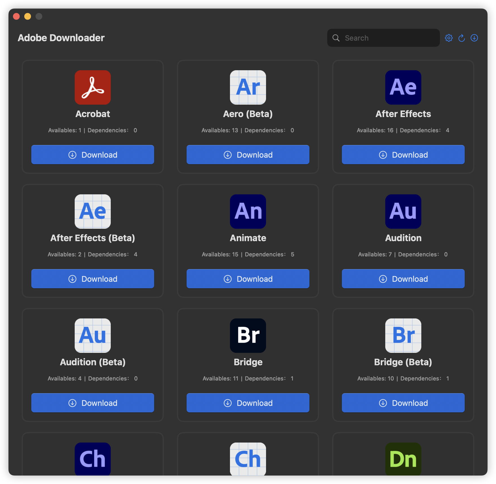

# Adobe Downloader


## Before Use

**🍎Only for macOS 14+.**

> **If you like Adobe Downloader, or it helps you, please Star🌟 it.**
>
> 1. Before proceeding with the installation, make sure you have
     installed [Adobe Creative Cloud](https://creativecloud.adobe.com/apps/download/creative-cloud)
> 2. In order to successfully install after downloading, you need to modify the Adobe Setup program. Thanks
     to [QiuChenly](https://github.com/QiuChenly)
     for providing the installation solution
> 3. If you encounter any problems, don't panic, contact [@X1a0He](https://t.me/X1a0He) on Telegram or use the Python
     version. Many thanks to [Drovosek01](https://github.com/Drovosek01) for
     the [adobe-packager](https://github.com/Drovosek01/adobe-packager)
> 4. ⚠️⚠️⚠️ **All Adobe apps in Adobe Downloader are from official Adobe channels and are not cracked versions.**
> 5. ❌❌❌ **Do not use an external hard drive or any USB to store it, as this will cause permission issues, I do not have
     the patience to solve any about permission issues**

## 📔Latest Log

- For historical update logs, please go to [Update Log](update-log.md)

- 2024-11-06 15:50 Update Log

```markdown
1. 增加程序首次启动时的默认配置设定与提示
2. 增加可选架构下载，请在设置中进行选择
3. 修复了版本已存在检测错误的问题 \(仅检测文件是否存在，并不会检测是否完整\)
4. 移除主界面的语言选择和目录选择，移动到了设置中
5. 版本选择页面增加架构提示
6. 移除了安装程序的机制，现在不会再生成安装程序
7. 增加了Adobe Creative Cloud安装检测，未安装前无法使用

====================

1. Added default configuration settings and prompts when the program is started for the first time
2. Added optional architecture downloads, please select in settings
3. Fixed the problem of version detection error \(only checks whether the file exists, not whether it is complete\)
4. Removed the language selection and directory selection on the main interface and moved them to settings
5. Added architecture prompts on the version selection page
6. Removed the installer mechanism, and now no installer will be generated
7. Added Adobe Creative Cloud installation detection, which cannot be used before installation
```

### Language friendly

- [x] Chinese
- [x] English

## ⚠️ Warning

**For all the SwiftUI seniors, I am just a SwiftUI newbie, some of the code comes from Claude, OpenAI and Apple, etc.**
\
**If you have any optimization suggestions or questions about Adobe Downloader, please open an issue or contact @X1a0He
via Telegram.**

## ✨ Features

- [x] Basic Functionality
    - [x] Download Acrobat Pro
    - [x] Download other Adobe products
    - [x] Support installation of non-Acrobat products
    - [x] Support multiple products download at the same time
    - [x] Supports using default language and default directory

## 👀 Preview

### Light Mode & Dark Mode




### Version Picker


### Language Picker


### Download Management


## 🔗 References

- [Drovosek01/adobe-packager](https://github.com/Drovosek01/adobe-packager/)
- [QiuChenly/InjectLib](https://github.com/QiuChenly/InjectLib/)

## 👨🏻‍💻Author

Adobe Downloader © X1a0He

Released under GPLv3. Created on 2024.11.05.

> GitHub [@X1a0He](https://github.com/X1a0He/) \
> Telegram [@X1a0He](https://t.me/X1a0He)
